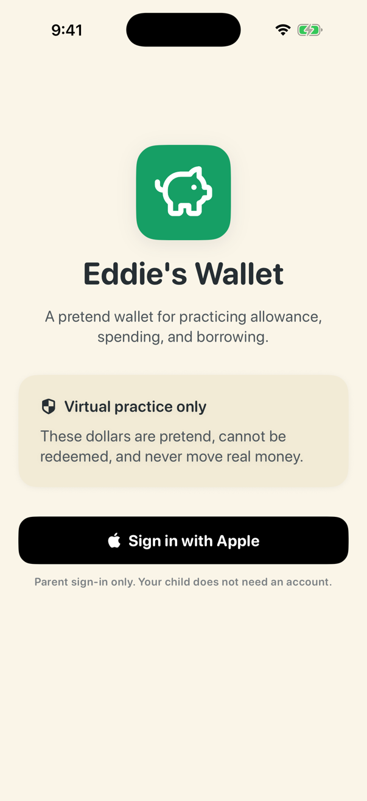
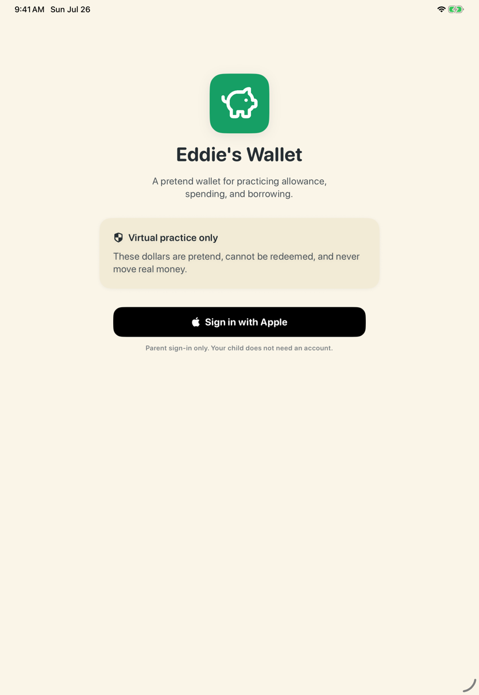

# Eddie's Wallet

Eddie's Wallet is an **unfinished native SwiftUI frontend MVP** for iPhone and iPad: a calm, parent-managed pretend wallet that helps one child practice allowance, spending, borrowing, and repayment. This repository exists so you can read the source, build it in the iOS Simulator, and follow the accompanying code walkthrough. It is **not** a download, an App Store product, a released app, or a live, end-to-end-verified financial service.

**Every dollar the app displays is virtual, pretend, and nonredeemable. No real money ever moves through Eddie's Wallet.** There are no banks, cards, payment rails, or cash-out paths. One signed-in parent records every change (allowance, deposits, withdrawals, loans, repayments). The managed child profile is a read-only view: the child has no independent account, login, or way to change the wallet.

**Who this is for:** developers and reviewers who want to explore a small, dependency-free SwiftUI client, and anyone following the product concept in the [product requirements document](docs/product-requirements.md). If you are looking for an app to install for your family, this is not that yet.

<p align="center">
  
  
</p>

*Both screenshots show the signed-out welcome experience built from this repository. No family data exists in a fresh install.*

## What exists today

- A native SwiftUI iOS/iPadOS app (`EddysWallet.xcodeproj`) targeting iOS 17.0+, iPhone and iPad, with no third-party dependencies.
- A kid-first navigation model: a configured device rests on the child's read-only wallet, and all parent money flows, the allowance rule, PIN change, and sign-out live in a temporary full-screen Parent area behind a "Grown-ups" door and the parent-set PIN. Parent access is never persisted; backgrounding or relaunching always returns to the kid home. A forgotten PIN is recovered with a fresh Sign in with Apple by the owning parent.
- Money-event flows with review steps, a starter lesson path, and honest offline/pending/rejected states, implemented against the [product requirements](docs/product-requirements.md).
- Unit, contract-style transport, and native UI tests in the shared scheme that run entirely against injected fakes and never call a live service.
- A copied web design system and click-through prototype, packaged as the `eddies-wallet-design` agent skill under `.agents/skills/eddies-wallet-design/`, kept as visual reference material; the native app is the maintained implementation.

What does not exist: releases, tags, an App Store listing, a privacy manifest, or verified live sign-in. Release automation to TestFlight is configured (see the [release pipeline](docs/release.md)) but has not produced a release yet. See [Known limitations](#known-limitations).

## Getting started

Prerequisites: a Mac with Xcode 26.4 or later (this repository was last verified with Xcode 26.4 and the iOS 26.4 simulator runtime). There are no package-manager dependencies to resolve, and no Apple developer account is needed for simulator builds and tests.

Clone anonymously over HTTPS:

```sh
git clone https://github.com/kunchenguid/eddies-wallet.git
cd eddies-wallet
```

Open `EddysWallet.xcodeproj` in Xcode and use the shared `EddysWallet` scheme, or work from the command line. Run the test suite in the iOS Simulator:

```sh
xcodebuild -project EddysWallet.xcodeproj -scheme EddysWallet \
  -destination 'platform=iOS Simulator,name=iPhone 17 Pro,OS=26.4' test
```

Build a signing-independent Release binary for the simulator:

```sh
xcodebuild -project EddysWallet.xcodeproj -scheme EddysWallet \
  -configuration Release -destination 'generic/platform=iOS Simulator' \
  CODE_SIGNING_ALLOWED=NO build
```

If your installed simulator runtime differs, substitute any available iPhone destination (`xcodebuild -project EddysWallet.xcodeproj -scheme EddysWallet -showdestinations` lists them). The declared deployment target is iOS 17.0, but recent verification used iOS 26 simulators.

**Signing expectations:** building and testing in the simulator requires no signing setup. Actually exercising Sign in with Apple requires membership in the Apple Developer team that owns the app ID, as described in [`EddysWallet/README.md`](EddysWallet/README.md); that is an external prerequisite this repository cannot provide, and nothing in this repository requires it for local builds or tests.

## Architecture boundary

This repository contains only the client. The app is designed to talk to a separately maintained, privately operated service through a small versioned HTTP API; the service's source, operations, and credentials are not part of this repository, and no private access is needed to build or test the code here. `APIWalletRepository` implements the client side of that contract, and `MockWalletRepository` backs previews and tests. The service is authoritative for all wallet data; the client never treats local state as accepted money. Details are in [`EddysWallet/README.md`](EddysWallet/README.md).

## Project layout

| Path | Contents |
| --- | --- |
| `EddysWallet/` | App source: views, models, API client, design tokens, and a [client README](EddysWallet/README.md) covering configuration, keychain use, and signing |
| `EddysWalletTests/` | Unit and transport-contract tests |
| `EddysWalletUITests/` | Native UI tests and the synthetic screenshot tour |
| `EddysWallet.xcodeproj` | Xcode project with the shared `EddysWallet` scheme |
| `docs/` | [Product requirements](docs/product-requirements.md), [video claims checklist](docs/video-claims-checklist.md), and screenshots |
| `.agents/skills/eddies-wallet-design/` | Copied web design system and prototype, packaged as an agent skill and kept as visual reference; `.claude/skills` is a symlink to `.agents/skills` so Claude Code discovers the same directory |

## Known limitations

- This is an unfinished MVP. Live Apple sign-in and the full family flow against the production service have **not** been verified end to end; verification so far covers local builds, the test suite, the signed-out welcome UI, and synthetic signed-in UI scenarios.
- There is no released, downloadable, or App Store-ready build: no privacy manifest, no signed archive evidence, no release notes, and no tags. The [release pipeline](docs/release.md) exists but its Apple-side prerequisites are not complete, and no build has been uploaded anywhere.
- Pull requests run a credential-free build-and-test workflow on GitHub Actions; everything else about verification remains local evidence.
- The declared iOS 17.0 minimum has not been exercised on an iOS 17 simulator runtime recently.
- The `.agents/skills/eddies-wallet-design/` prototype is unmaintained reference material and may not run as-is.
- Privacy, retention, export, and deletion decisions required for a public launch remain open in the [product requirements](docs/product-requirements.md).

## Support and security

- Questions about building, the source, or the documentation: open a public [GitHub issue](https://github.com/kunchenguid/eddies-wallet/issues). See [SUPPORT.md](SUPPORT.md).
- Security or privacy findings, especially anything touching children or family data: use the private reporting route in [SECURITY.md](SECURITY.md). Please never post sensitive findings publicly.

## Documentation

- [Product requirements document](docs/product-requirements.md): the full MVP PRD this app implements.
- [Video claims checklist](docs/video-claims-checklist.md): the limitations any public presentation of this repository must state.
- [Client README](EddysWallet/README.md): API configuration, keychain behavior, signing prerequisites, and the manual test sequence.
- [Release pipeline](docs/release.md): the release-please and TestFlight automation, its approval boundary, and its one-time setup.

## License

Eddie's Wallet is licensed under the [MIT License](LICENSE), Copyright (c) 2026 Kun Chen.
